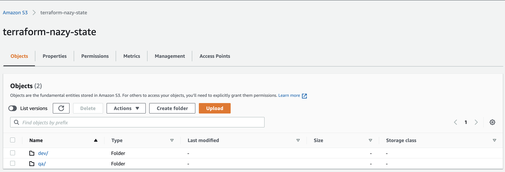
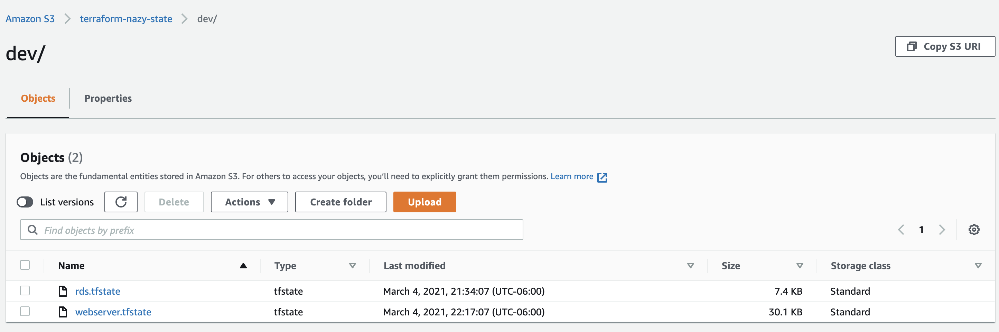
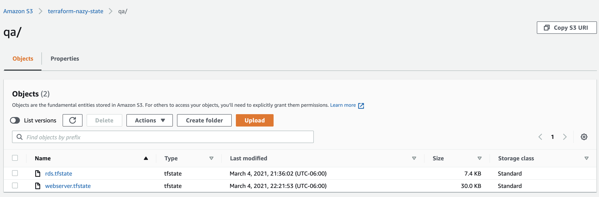

## Environment separation in Terraform with modules.

In terraform modules repository we will have examples of how we can build separate environments with the help of `folder structure` and the `wrapper`, we can have it on the top of the folder structure.

## Prerequisites
- AWS account
- Terraform installed
- VS Code installed

## Environment separation "Folders structure"

When we separate our environments with `folder structure` we have different directories for different environments, which gives us ability to provision the same infrastructure in different environment without any interference. Lets say we want to create the same infra in `dev` as we have in `qa` calling the same `child modules`,  storing backend files separately makes it possible.  

In `modules` folder we have rds && webserver (child) modules and both `dev`  and `qa` folders contains rds && webserver (root) modules. `child modules` have configuration files of resources that later we call from  a `root module`. Also in `child module` we don't have  providers.tf file or any `.terraform` folders ( as we don't initialize this folder as a working directory). Basically we use `child module` as ready template that we can later use as a base when we create resources in different environments. Another thing to mentioned is that variables defined in `child module` we can call `root module` from a and values for them we give in , lets check how it looks.and defined `variables`  and pass the values 

`modules/web_server/variables.tf` child module,
```
variable "env" {
    description = "name of the env"
    type = string
}
variable "instance_type" {
    description = "instance type"
    type = string
}
variable "remote_state" {
  type = map(string)
}
```

`qa/webserver_qa/main_webserver.tf` root module,
```
module "webserver_module" {
  source = "../../modules/web_server"
  
  env = "qa"
  instance_type = "t2.micro"
  
  remote_state = {
      bucket = "terraform-nazy-state"
      key = "qa/rds.tfstate"
      region = "us-east-1"
  }
}
```

We can add additional resources inside of the root module in this case it is pet_name resource, it can be changed depending on which environment you are creating your resources.

The reason why we are leaving providers file in  child modules folder with keys=values ``` required_version = "~> 0.14.0"``` & ```version = "~> 3.0" ```  because when we call it we are going to  need to have terraform block, as well as we will know which version of terraform our code is compatible with. And if someone comes and uses our code they will know which version of terraform needs to be used. 
On rds example ```isolating environment``` happened using ```folders structure``` where only input variables changed, this is a one way of doing it. In both root modules ```dev``` && ```qa``` we are calling the same child ```rds``` module , but depending on environment its getting created in different environments. For ```qa``` env we added in child module ```pet_name``` resource and called it from there. So it brings us to the conclusion, that we can use the same template for different environments.

<p>
When we create rds db and  try to refer to it’s remote file from our web-server in root module we won’t be able  to find it, because in child web-server module we have remote state file, and our code will break,  in order to make it work we use map variables in child web-server module and define those variables in child module’s variables file and after that we should be able to pass our variables the  root web-server module.
When we call user_data from our root web-server module in child module we have to use “template = file("${path.module}/user_data.sh")” , otherwise it will look for the user_data inside of the root module and it won’t file it there, and it will give an error. But the path.module should solve that problem for us.
</p>

On AWS console it will look like this:


Content of state folder:



Content of dev environment folder:



Content of qa environmetn folder:



## Wrapper 

<p>
On top of the folder structure environment isolation we can also use wrapper which is creating isolated workspaces using Terraform. Most likely the wrapper type of work isolation you will use for pipeline and when you deploy your resources, you will get a drop down list and you can choose which environment you want and correct version of your resources.  Your pipeline will come and get dev.tf or qa.tf files from your tfvars folder,  but before that it has to set the correct backend where we used a placeholder for [env].
</p>

<p>
Inside of the wrappers folder we create  rds and webserver (root) module folders and each of them will have tfvars folder  with dev.tf and qa.tf files, values will be same as inside of the root module.
</p>

```
  env = "dev"
  storage = 12
  skip_snapshot = "true"
  instance_class = "db.t2.micro"
  username = "dev_user"

```

In the backend file of root rds module we have terraform block where we can’t use the interpolations, it has to be hard coded, to go around it we use place holder like ```[env]```. That allow us to supply different environments using values from dev.tf or qa.tf variables file. If its ```dev``` environment it will provision in ```dev environment``` , if it's ```qa``` environment it will create resources in ```qa environment```.  The next change we will have inside of the main.tf (root module rds) here since we give the values for environments in tfvars folder, we also create variables file where we define our given values in root rds module.

```
  env = var.env
  storage = 12
  skip_snapshot = var.skip_snapshot
  instance_class = var.instance_class
  username = var.username

```
We also create variables.tf file where we define our given values in root rds module file.

```
### Define root module variables

variable "env" {
    description = "the name of the environment"
    type = string
    default = "dev"
} 

variable "storage" {
    description = "the storage size of database"
    type = string
}

variable "skip_snapshot" {
    description = "it will skip the final snapshot incase if someone deletes database by accident"
    type = bool
}

variable "instance_class" {
    description = " database instance class"
    type = string
}

variable "username" {
    description = "the username of database"
    type = string
}
```
Even though we set up a backend file terraform still creates tfstate file for backup and terraform will refer to that file because it will have information about dev environment in dev state file and qa environment in qa state file. From the wrapper folder , since we are not using different folders, there are will be .terraform created and inside of it terraform.tfstate, we have to remove that one , because we are using backend. And the next bash script set_env.sh (inside of the wrapper folder) will help us to do that in the second line of script and will help us to set environment. Each time when we run our bash script with providers argument ```./set_env.sh``` ```dev``` or ```qa``` it will go change the environment in the backend file.
for dev environment
```
bash set_env.sh dev 
```
for qa environment
``` 
bash set_env.sh qa   
```
```
#!/bin/bash
rm -rf .terraform/terraform.tfstate
ENV="$1"
sed -i ' ' -e "s|__env__|$ENV|" backend.tf
terraform init
echo "Environment is set to $ENV"
```
In pipeline you are going to choose environment and version as we said earlier, and then most likely it will be downloaded from the GitHub and when it will get downloaded your backend.tf file will look like this:
```
terrform {
  backend “s3”
    bucket  = “terraform-nazy-state”
    key      = “__env__/rds.tfstate”
    region = “us-east-1”
    dynamo_table = “terraform-state-locks”
}
```
Once the environment is set you can use your regular:
```
terraform apply var-file tfvars/dev.tf
```
or
```
terraform apply var-file tfvars/qa.tf
```
depending which environment you are creating your resources. 
In order to avoid issues with extra created backend.tf you might want to add to your dev.tf file next lines:
```
  bucket = "terraform-nazy-state"
  key = "dev/rds.tfstate"
  region = "us-east-1"
  dynamodb_table = "terraform-state-locks" 
```
Where you specify your backend.tf name and location. The same thing you will do for qa.tf. Usually your backend.tf won't be in your wrapper folder, in Jenkins it will come to dev.tf file and read the values of the bucket, region, key and dynamodb_table and will create the backend.tf for you. After that it will run
```
terraform init
terraform plan
terraform apply
```
Also it does it for terraform.lock file as well, because we set the proper restrictions in providers section. And it's even setting the modules. 
But changing the environment this way is not the final version you can make your bash script to change the values of the backend file , let's say __env__ part of ``` key = “__env__/rds.tfstate”``` so it does't have to recreate your backend.tf each time. 
Inside of your rds root module you can also create new resource file using ```count``` module , depending for which environment create resources or not.

### Notes

Whenever we do changes on backend.tf of the location for remote_state file we need to run terraform init, to initialize the new location of the s3 bucket.