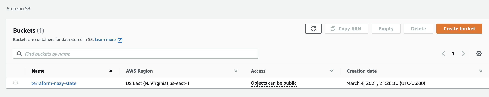
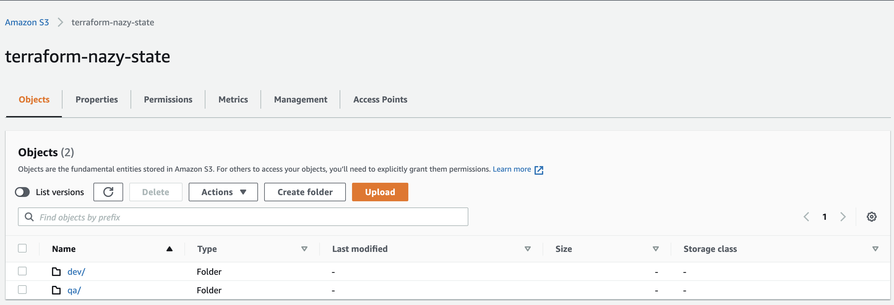
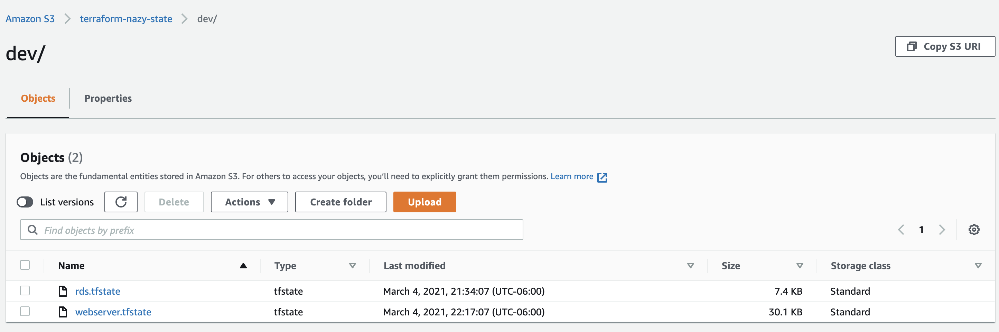
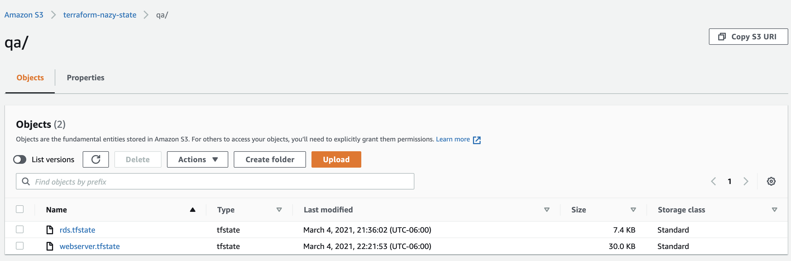

## Environment separation in Terraform with modules.

In terraform_modules_folder_structure repository we will have an example of how we can separate environments with  `folder structure` and the `wrapper`, which we can have it on the top of the folder structure. Since we will have our backend files remotely in S3 bucket we also have remote_s3_backend folder, where we configured s3 bucket for backend files and dynamo_db for locking. Before we provision any of our root modules, we have to make sure that our S3 bucket exist, so provision S3 bucket first.

## Prerequisites

- AWS account
- Terraform installed
- VS Code installed

### The order of provisioning resources

- remote_s3_backend
- rds_dev or qa (depending on the enviroment)
- webserver_dev or qa (depending on the enviroment)

## Environment separation "Folders structure"

When we separate our environments with `folder structure` we have different directories for different environments, which gives us ability to provision the same infrastructure in different environment without any interference between them (when you have your state file locally to recreate the same infra in different envirnment you have to destroy the first one). Lets say we want to create the same infra in `dev` as we have in `qa` calling the same `child module`,  storing backend files separately in S3 bucket makes it possible. On AWS console it will look like this:



In `modules` folder we have rds && webserver (child) modules and both `dev`  and `qa` folders contains rds && webserver (root) modules. `child modules` have configuration files of resources that later we call from  a `root module`. Also in `child module` we don't have any `.terraform` folders (as we don't initialize this folder as a working directory). Basically we use `child module` as ready template that we can later reused as a base when we create resources in different environments. 

Content of S3 bucket folder:



Content of `dev` environment folder:



Content of `qa` environment folder:



In our example we created `rds` and refered to it’s `remote_state` file from our `webserver` root module but, terraform won’t be able to find it, because in webserver `child  module` we have already remote_state file, and our code will break. For that reason we used map variables defined in `webserver` child module and just after that we should be able to pass our variables the `webserver` root module. Let's see how it looks, defined `variables` in child module and passed the values in root module.

`modules/webserver/variables.tf` child module,
```
variable "env" {
    description = "name of the env"
    type = string
}
variable "instance_type" {
    description = "instance type"
    type = string
}
variable "remote_state" {
  type = map(string)
}
```

`modules/webserver/remote_state.tf` child module backend,
```
data "terraform_remote_state" "rds" {
  backend = "s3"
  config  = {
    bucket = var.remote_state["bucket"]
    key    = var.remote_state["key"]
    region = var.remote_state["region"]
   }                                                                      
  }
```

In the root module `qa/webserver_qa/main_webserver.tf` we gave the values for those variables,
```
module "webserver_module" {
  source = "../../modules/web_server"
  
  env = "qa"
  instance_type = "t2.micro"
  
  remote_state = {
      bucket = "terraform-nazy-state"
      key = "qa/rds.tfstate"
      region = "us-east-1"
  }
}
```

In `root module` when we call `child module` we can also add additional resources inside of the root module in this case it is pet_name resource, it can be changed depending on which environment you are creating your resources. 
```
module "webserver_module" {
  source = "../../modules/webserver"
  ..................
  }
}
resource "random_pet" "test" {
  count = 1
}

output "pet_name_value" {
  value = random_pet.test[*].id
}
```

Here we also used conditions in `rds` child module we added `pet_name` resource and called it from a root module in outputs.tf for `qa` environment we gave a condition if this resource will be provisioned in `qa` create a `pet name`, if not don't create. 

pet.tf in child module,
```
resource "random_pet" "test" {
  count = var.env == "dev" ? 1 : 0
}

output "module_pet_name_value" {
  value = random_pet.test[*].id
}
```

outputs.tf root module,
```
output "username" {
  value = module.rds_module.module_username
}
output "address" {
  value = module.rds_module.module_address
}
output "pet_name" {
  value = module.rds_module.module_pet_name_value
}
```

We are leaving providers.tf file in `child modules` because when we call that `child module` we need know from `terraform block` the version of Terraform that module was created `required_version = "~> 0.14.0"` & `version = "~> 3.0"`, for compatiblity with the version of Terraform in `root module`. When you run terraform init command Terraform will find the matching version of terraform. And if someone uses our code they will know which version of terraform needs to be installed.  

After creating RDS we can refer to it’s `remote_state` file from `webserver` root module to retrive some data. For that we can to create data_source since it's existing resource and fetch the data from it the outputs, for that example check this repository [session_7/frontend](https://github.com/nazy67/terraform-session/blob/master/session_7/frontend). 

When we call `user_data` from our `webserver root module` in `webserver child module` we have to use `path.module`, otherwise terraform will look for the `user_data` inside of the  `webserver root module` and it won’t find it which will give an error. But the path.module should solve that problem for us.

`modules/webserver/data_source.tf` child module,
```
data "template_file" "user_data"  {
  template = filebase64("${path.module}/template_file/user_data.sh") 
  vars = {  
    env = var.env
  }
}
```

## Notes

Whenever we do changes on backend.tf of the location for remote_state file we need to run terraform init, to initialize the new location of the s3 bucket.